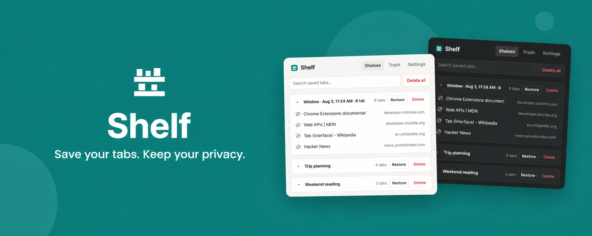
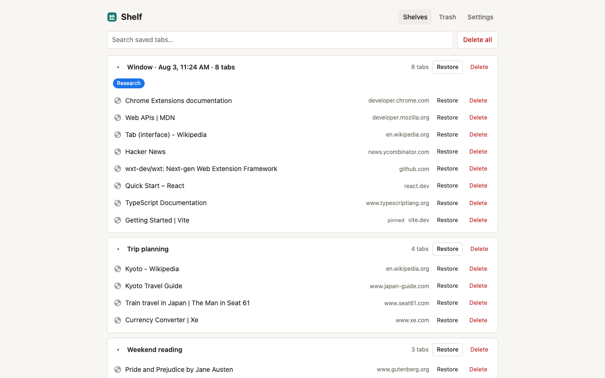
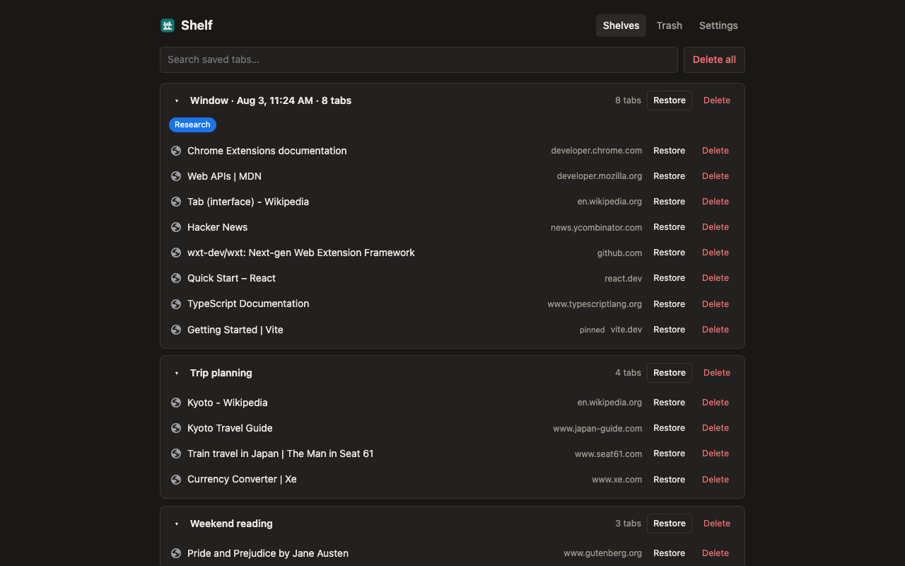
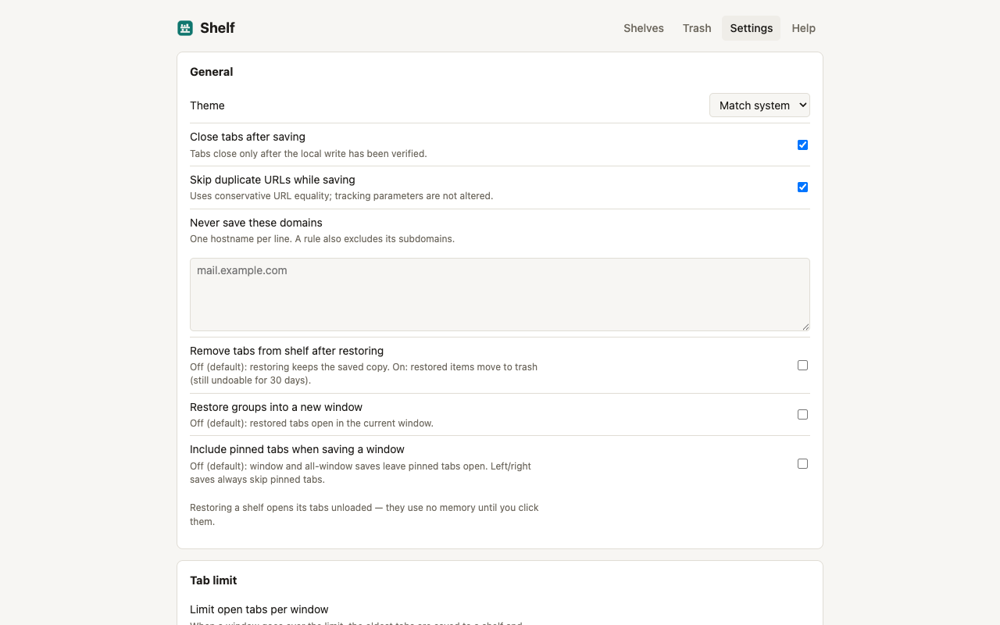

# Shelf

[](https://github.com/mirza-rizvi/shelf/actions/workflows/ci.yml)
[](LICENSE)
[](https://developer.chrome.com/docs/extensions/develop/migrate/what-is-mv3)

Shelf is a privacy-first tab manager for Chrome and Chromium browsers. Save open tabs into local sessions, close them only after a verified write, and restore them later without an account, cloud service, analytics, or tracking.



## Why Shelf

- Save one tab, highlighted tabs, a tab group, a window, or every window.
- Save without closing, or close tabs only after the saved data is verified.
- Find saved tabs with one fast search across session names, titles, and URLs.
- Restore individual tabs or whole sessions while keeping the saved copy by default.
- Detect and recoverably remove duplicate URLs.
- Preserve Chrome tab-group names, colors, order, and pinned state.
- Undo deletions through a local 30-day trash and export versioned JSON backups.
- Import OneTab URL exports.
- Use keyboard commands, context menus, dark mode, and an optional tab limit.

Shelf stores data in `chrome.storage.local`. It makes no external requests and requests no host permissions. See the [privacy policy](docs/PRIVACY.md) and [threat model](docs/THREAT-MODEL.md) for the exact guarantees and limitations.

## See Shelf in action

### Save, search, and restore

Saved tabs stay organized in a fast, searchable session list with focused restore and delete actions.



### Comfortable in dark mode

Shelf follows your preferred theme while keeping the same clear session overview.



### Control how Shelf behaves

Choose when source tabs close, skip duplicate URLs, exclude domains, adjust restore behavior, and optionally set a per-window tab limit.



## Install from source

Requirements: Node.js 20 or newer, npm, and Chrome 121 or newer.

```bash
git clone https://github.com/mirza-rizvi/shelf.git
cd shelf
npm ci
npm run build
```

Open `chrome://extensions`, enable **Developer mode**, choose **Load unpacked**, and select `dist/chrome-mv3`.

> Uninstalling a Chrome extension deletes its local extension storage. Export a JSON backup before uninstalling Shelf if you want to keep your saved tabs.

## Development

```bash
npm run dev       # development build with HMR
npm run compile   # TypeScript check
npm test          # automated tests
npm run build     # production extension
npm run zip       # Chrome Web Store archive
npm run check     # compile, test, and production build
npm run release:check # full store-release gate + ZIP checksum
```

The implementation deliberately avoids extra infrastructure: no backend, account, telemetry SDK, content script, host permission, or cloud-sync code. React-compatible source is bundled against Preact to keep the pinned manager lightweight.

## Permissions

| Permission | Purpose |
|---|---|
| `tabs` | Read the URLs and titles of tabs the user explicitly saves, close saved tabs, and restore them. |
| `storage`, `unlimitedStorage` | Store saved sessions, trash, and settings locally without the default quota. |
| `tabGroups` | Preserve and recreate native Chrome tab groups. |
| `alarms` | Run trash cleanup, orphan cleanup, and optional tab-limit checks without a persistent background page. |
| `favicon` | Display icons from Chrome's local favicon cache without contacting websites or an icon service. |
| `contextMenus` | Provide explicit save actions in Chrome's context menu. |

There are no host permissions, content scripts, optional permissions, remote scripts, or externally hosted assets.

## Documentation

- [Architecture](docs/ARCHITECTURE.md)
- [Product requirements](docs/PRD.md)
- [Privacy policy](docs/PRIVACY.md)
- [Threat model](docs/THREAT-MODEL.md)
- [Testing](docs/TESTING.md)
- [Chrome Web Store listing](docs/STORE-LISTING.md)
- [Contributing](CONTRIBUTING.md)
- [Support](SUPPORT.md)
- [Code of conduct](CODE_OF_CONDUCT.md)
- [Security policy](SECURITY.md)
- [Changelog](CHANGELOG.md)

## License

[MIT](LICENSE) © 2026 Shelf contributors.
